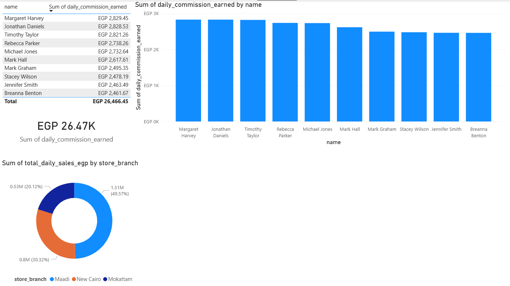

# End-to-End Retail Data Engineering Pipeline

## 📌 Project Overview
This project simulates an enterprise-level data pipeline for a multi-branch retail environment. It extracts raw daily transaction logs and employee data, transforms it using complex business logic, and loads it into a local SQL Server Data Warehouse for business intelligence reporting. 

The goal of this pipeline is to automate the calculation of daily branch performance and employee commission payouts, eliminating manual data entry and spreadsheet errors.

## 🏗️ Architecture & Tech Stack
* **Data Generation:** Python (`pandas`, `faker`)
* **Data Lake (Storage):** Azurite (Local Azure Blob Storage Emulator)
* **Data Warehouse:** Microsoft SQL Server (Star Schema modeling)
* **ETL Orchestration:** Python (`sqlalchemy`, `azure-storage-blob`)
* **Business Intelligence:** Power BI

## ⚙️ The Business Logic (Transformations)
Raw data is rarely ready for reporting. This pipeline applies several realistic business rules during the transformation phase:
1. **Data Aggregation:** Consolidates thousands of raw, timestamped POS transactions into clean daily totals per employee and branch.
2. **Shift Logic Handling:** Accounts for variable store hours (e.g., standard 10:00 PM closures vs. extended 11:00 PM weekend shifts).
3. **Commission & Salary Rollups:** Integrates a complex employee dimension table to calculate a 1% commission on total sales, while cleanly separating it from fixed base salary structures.
4. **Payout Lag Application:** Automatically applies a 14-day processing lag to commission payout dates for financial accuracy.

## 📊 The Final Dashboard

## 🚀 How to Run This Project Locally
1. Start the Azurite emulator on port 10000.
2. Ensure SQL Server is running and create a blank database named `RetailDW`.
3. Run `python data_generator.py` to generate the raw branch data.
4. Run `python phase2_ingestion.py` to push the raw data to the Azurite Data Lake.
5. Run `python phase3_transformation.py` to execute the ETL logic.
6. Run `python phase4_sqlserver.py` to load the clean data into the SQL Server Star Schema.
